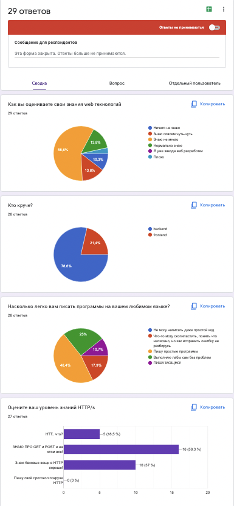

* 08.09.2022 33201 33211

Знакомство.
Провели опрос:

Ребята сказали, что был курс по верстке и java spring rest.

Вскользь упомянули назначение javascript, html, css.
На примере страницы Википедии проверили что произойдет если отключить javascript
Посмотрели на 2 способа подключения css / javascript (инлайн и через отдельный файл)
Заглянули в разные javascript файлы, посмотрели что там находится.
Обратили внимание на минифицированнаый js файл.

* 10.09.2022 33201 
Поговорили о понятии "WEB технологии", рассуждали о резнице [WEB](https://en.wikipedia.org/wiki/World_Wide_Web) и [internet](https://en.wikipedia.org/wiki/Internet).
Поговорили о том, где можно встретить web технологии
Поговорили про [electron](https://www.electronjs.org/), [webview](https://developer.android.com/reference/android/webkit/WebView),
[PWA](https://en.wikipedia.org/wiki/Progressive_web_app)
Немного обсудили разницу между понятиями сайт и приложение.
Попробовали создать простейшее приложение с помощью HTML и javascript: 2 поля ввода, кнопка сложить. при нажатии на кнопку "сложить", нужно считать значение из инпутов, сложить, и положить результат в отдельный элемент.
Тут мы несколько раз обратили внимание на то, что browser предоставляет api для чтения и модификации [DOM](https://developer.mozilla.org/ru/docs/Web/API/Document_Object_Model/Introduction)
Мы разобрали несколько методов поиска DOM элементов
[getElementById](https://developer.mozilla.org/ru/docs/Web/API/Document/getElementById)
[getElementsByClassName](https://developer.mozilla.org/ru/docs/Web/API/Document/querySelector)
[querySelector](https://developer.mozilla.org/ru/docs/Web/API/Document/getElementsByClassName)
[getElementsByName](https://developer.mozilla.org/ru/docs/Web/API/Document/getElementsByName)
[getElementsByTagName](https://developer.mozilla.org/ru/docs/Web/API/Document/getElementsByTagName)
Возник интересный момент что я не знал ограничения на то, каким может быть id элемента и мы поставили id="1", но селектор не сработал
Обещал узнать; Подробнее описано [тут](https://developer.mozilla.org/en-US/docs/Web/HTML/Global_attributes/id)

Далее мы считали свойство `value` элемента с типом [input](https://developer.mozilla.org/en-US/docs/Web/HTML/Element/input)
В этом свойстве лежала строка и нам нужно было получить из нее число. Для этого мы использовали [parseFloat](https://developer.mozilla.org/ru/docs/Web/JavaScript/Reference/Global_Objects/parseFloat) и [parseInt](https://developer.mozilla.org/ru/docs/Web/JavaScript/Reference/Global_Objects/parseInt)

Далее мы записали результат в `innerText` и увидели как браузер отобразил это изменение.
Потом мы решили убрать кнопку и считать результат по изменению в поле.
Мы рассмотрели понятие обработчика событий. 
Воспользовались `button.onclick = handleClick` и [addEventListener](https://www.w3schools.com/jsref/met_element_addeventlistener.asp)
Посмотрели как ведет себя обработчик событий `click`, `change`, `keydown`, `keyup`
Упомянули понятие активный элемент.
В течении пары мы использовали devtools console, потом мы решили положить код в скрипт, и подключить его. Мы поговорили про порядок парсинга и исполнения js
Упомянули про то, что можно контролировать загрузку и исполнения скрипта аттрибутами [async, defer](https://javascript.info/script-async-defer)
Кратко поговорили про то, как работают события в DOM https://learn.javascript.ru/introduction-browser-events
Обсудили зачем нужны [stopPropagation](https://developer.mozilla.org/ru/docs/Web/API/Event/stopPropagation), [preventDefault](https://developer.mozilla.org/ru/docs/Web/API/Event/preventDefault)

Разбирали способы отправки запроса на сервер.
Разобрали способ [отправки данных на сервер без js](https://developer.mozilla.org/en-US/docs/Learn/Forms/Sending_and_retrieving_form_data)
Подметили что данные на сервер можно так же отправить тегами `script, link, a, img`  и тд
Разобрали [пример отправки запроса](https://javascript.info/xmlhttprequest) с помощью [XMLHttpRequest](https://developer.mozilla.org/ru/docs/Web/API/XMLHttpRequest) 
Поговорили о том что на основе этого апи есть куча библиотек, таких как [superagent](https://www.npmjs.com/package/superagent), [axios](https://github.com/axios/axios)
Поговорили про более современный API [fetch](https://developer.mozilla.org/ru/docs/Web/API/Fetch_API/Using_Fetch)
Упомянули про [Promise](https://developer.mozilla.org/en-US/docs/Web/JavaScript/Reference/Global_Objects/Promise)

Про javascript мы погоговорили очень отдаленно, в примерах мы использовали:
[Объявление переменных](https://learn.javascript.ru/variables), [объявление функций](https://learn.javascript.ru/variables), [стрелочные функции](https://learn.javascript.ru/arrow-functions-basics)

Таким образом мы разобрали самую базу:
Поиск, чтение аттрибутов, модификация DOM, обработка событий, отправка запросов на сервер и их обработка.
Крайне рекомендую, тем, кто не имеет никакого представления про WEB - изучить все ссылки, которые тут находятся, воспроизвести шаги, которые мы прошли.
